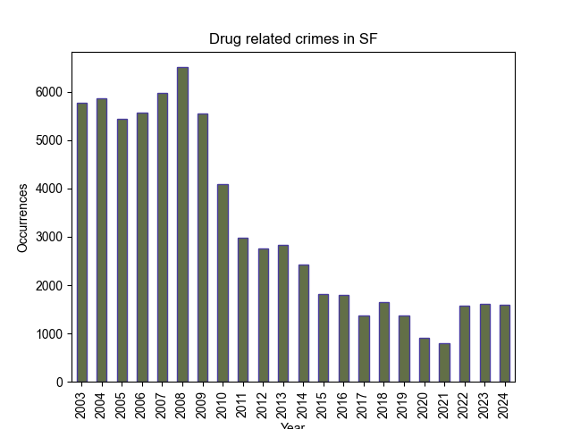

* * *

## Data introduction
The dataset that provides the basis for this analysis is a concatenation of a historical [dataset](https://data.sfgov.org/Public-Safety/Police-Department-Incident-Reports-Historical-2003/tmnf-yvry/about_data) of crime incidents recorded in San Francisco in the time period 2003-2018
and a corresponding [dataset](https://data.sfgov.org/Public-Safety/Police-Department-Incident-Reports-2018-to-Present/wg3w-h783/about_data)
with ongoing data collection in the time period 2018-2025. The dataset consists of 2342093
unique crime incidents with a number of interesting recorded features including, but not
limited to: unique incident number, crime category, date and time of the incident report,
geo location and district. It should be noted that for the purpose of fair comparisons
between whole years, we exclude data from 2025 from this analysis.

## History of drug related crimes in SF

San Francisco has a long track record of struggle against drug related crime. Historically, 
abuse of pain killers such as OxyContin has been a big problem in SF, both as a cause 
for addiction in itself, but also as a path towards even more hardcore drugs, such as 
heroin. In 2017, a study showed that 80% of heroin users reported beginning with 
prescription opiods [[1]](https://www.sfpublicpress.org/san-franciscos-fatal-overdose-crisis-was-decades-in-the-making/).
In recent years, the use of fentanyl as seen a huge increase, especially among the homeless 
population of SF. Figure 1 shows the evolution of the number of drug related crime incidents 
throughout the years [[2]](https://www.ucsf.edu/news/2024/05/427651/smoking-fentanyl-rising-sf-deadly-new-risk-overdose#:~:text=San%20Francisco%20reached%20an%20all,cocaine%2C%20are%20on%20the%20rise.).

> Figure 1: The plot shows a significant decrease in the overall number of drug related crime incidents
> since the 2000s. One can observe first a steep decrease followed by a steady decrease until crime incidents
> hit its lowest level in the pandemic time period. Since 2022 there has been a resurgence in crime incidents.

## Drug related crime trends by district

As with many other types of crime, drug related crime does not usually distribute evenly over large cities.
In general, there exist certain indicators that typically go hand in hand with large amounts of drug activity.
These are things such as poverty level and homelessness. Tenderloin is the district of SF with the highest 
level of homelessness and is in general known for its prevalence of social issues [[3]](https://en.wikipedia.org/wiki/Tenderloin,_San_Francisco).
In figure 2, we illustrate the distribution of drug related crime throughout SF.

<html>
<head>
</head>
<body>
    <iframe src="plotly_plot.html" width="1000" height="510"></iframe>
    </body>
</html>
> Figure 2: The plot shows the distribution of drug related crime in all districts of SF in the time period 2003-2024.
> It is clear from the plot that Tenderloin is by far the most significantly impacted district with Southern and Mission
> also showing relatively high levels of drug related crime. On the other hand, we have Richmond and Taraval in the
> western-most parts of SF where drug crime is largely insignificant compared to the aforementioned districts.

Unsurprisingly, Tenderloin and surrounding districts show the highest drug crime counts. However, one thing we are 
still missing from these visualizations is how drug crime activity has changed over the years in individual districts.
In figure 3, we visualize this with an interactive plot, where one can choose which districts to display.

<html>
<head>
</head>
<body>
    <iframe src="bk_plot2.html" width="1000" height="510"></iframe>
    </body>
</html>
> Figure 3: The plot shows the evolution of the number of drug related crime incidents throughout the years for each
> district. Tenderloin, Mission and Southern seem to have been the dominating districts for drug crime activity for nearly
> the whole time period. In periods of overall low drug crime levels, Bayview and Northern show similar counts to
> Mission and Southern.

As seen on the figure 3, Tenderloin saw significantly higher counts than both Mission and Southern in the 2000s and early 2010s as well as
in the years 2018-2024. In the years between, all three districts saw very similar counts. Additionally, Mission and Southern seem to have
very similar yearly counts throughout the whole time period, with Mission having slightly higher counts in the early 2000s and Southern
having slightly higher counts in later years. The resurgence in drug crime counts of Tenderloin in later years can likely be attributed
to the fentanyl crisis which, as discussed earlier, is currently a significant issue among the homeless population [[4]](https://www.sfchronicle.com/projects/san-francisco-drug-overdose-deaths/).

